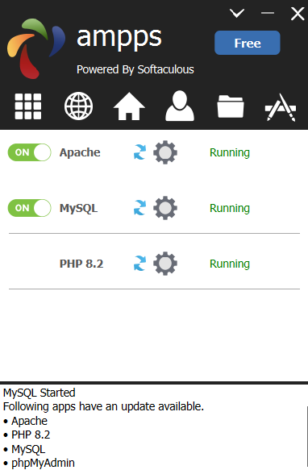
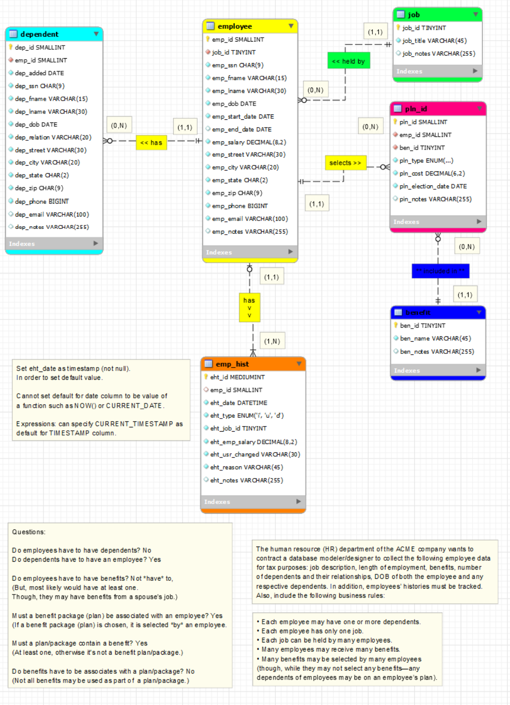
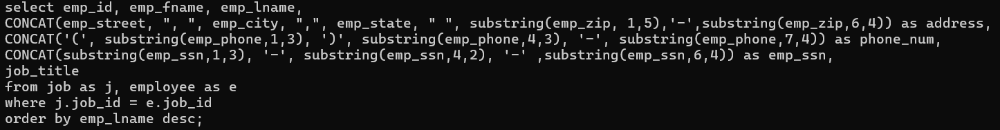
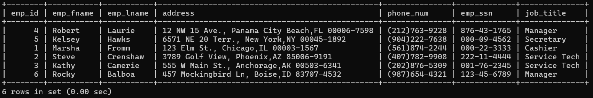

# LIS3781

## Mark Trombly

### Assignment 1 Requirements:

*Five Parts:*

1. Distributed Version Control with Git and Bitbucket.
2. AMPPS Installation on workstation
3. SQL Solution
4. Forward-engineered .sql file [lis3781_a1_solutions.sql](lis3781_a1_solutions.sql "lis3781_a1_solutions.sql Link")
5. git commands w/short descriptions

### **Business Rules** ###

The human resource (HR) department of the ACME company wants to contract a database modeler/designer to collect the following 
employee data for tax purposes: job description, length of employment, benefits, number of dependents and their relationships, DOB 
of both the employee and any respective dependents. In addition, employees’ histories must be tracked. Also, include the following 
business rules:

* Each employee may have one or more dependents.
* Each employee has only one job. 
* Each job can be held by many employees.
* Many employees may receive many benefits.
* Many benefits may be selected by many employees (though, while they may not select any benefits—any dependents of employees may be on an employee’s plan).

In addition:

* Employee: SSN, DOB, start/end dates, salary;
* Dependent: same information as their associated employee (though, not start/end dates), date added (as dependent), type of relationship: e.g., father, mother, etc.
* Job: title (e.g., secretary, service tech., manager, cashier, janitor, IT, etc.)
* Benefit: name (e.g., medical, dental, long-term disability, 401k, term life insurance, etc.)
* Plan: type (single, spouse, family), cost, election date (plans must be unique)
* Employee history: jobs, salaries, and benefit changes, as well as who made the change and why;
* Zero Filled data: SSN, zip codes (not phone numbers: US area codes not below 201, NJ);
* *All* tables must include notes attribute.

> #### Git commands w/short descriptions:

1. git init - Create an empty Git repository or reinitialize an existing one
2. git status - Show the working tree status
3. git add - Add file contents to the index
4. git commit - Record changes to the repository
5. git push - Update remote refs along with associated objects
6. git pull - Fetch from and integrate with another repository or a local branch
7. git config - Get and set repository or global options

#### Assignment Screenshots (Note: **BE SURE** to modify for specific course!):

*Screenshot of AMPPS running http://localhost*:

*Screenshot of A1 - ERD*:

*Screenshot of Ex - 1*:

**Ex 1 SQL Query:**

**Ex 1 Query Results:**

#### Repository Links:

*Bitbucket Repository*
[Bitbucket Repository Link](https://bitbucket.org/marktrombly/lis3781/src/master/ "Bitbucket Repository Link")