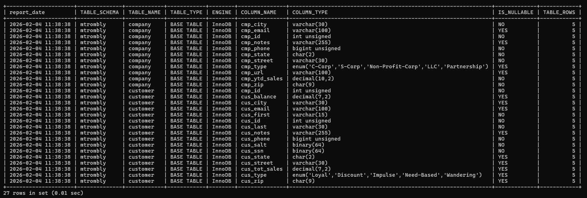
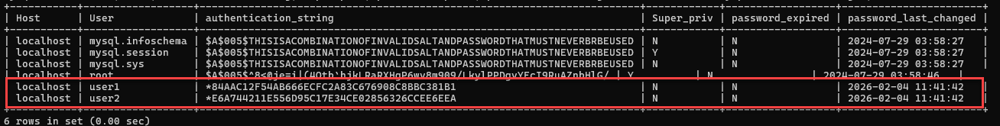

# LIS3781

## Mark Trombly

### Assignment 2 Requirements:

*Three Parts:*

1. Create sql statements to build company and customer tables.
2. Populate company and customer table data from sql file.
3. Create db users.

#### README.md file should include the following items:

* Screenshot to populated tables (mymetadata.sql)
* Screenshot of created users
* Sql solution [lis3781_a2_solutions.sql](lis3781_a2_solutions.sql "lis3781_a2_solutions.sql Link")

#### Assignment Screenshots

*Screenshot of populated tables (mymetadata.sql):

*Screenshot of created users:

#### Repository Links:

*Bitbucket Repository*
[Bitbucket Repository Link](https://bitbucket.org/marktrombly/lis3781/src/master/ "Bitbucket Repository Link")
