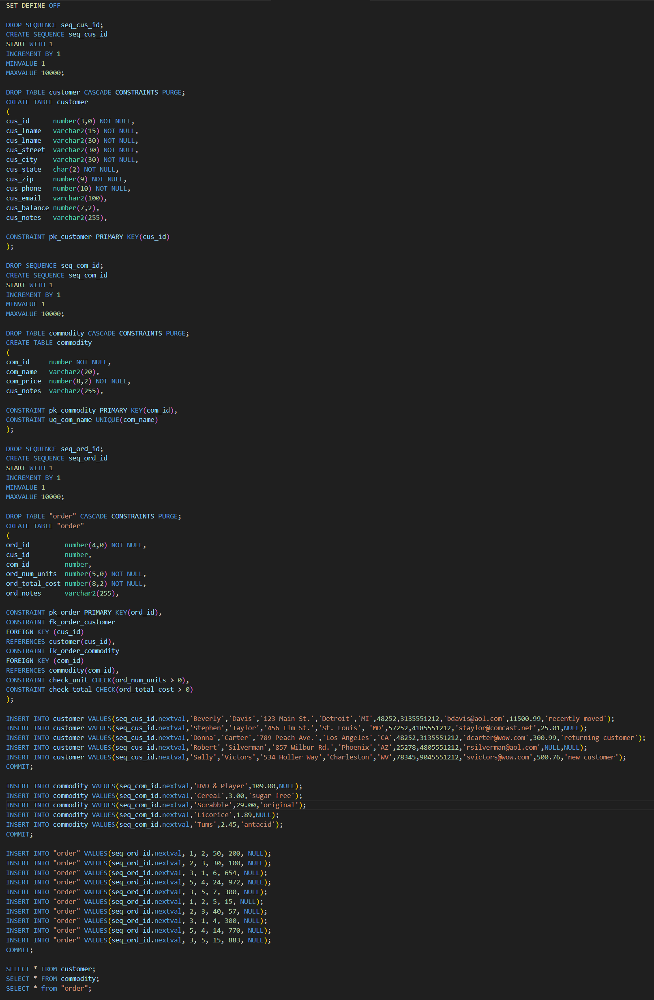
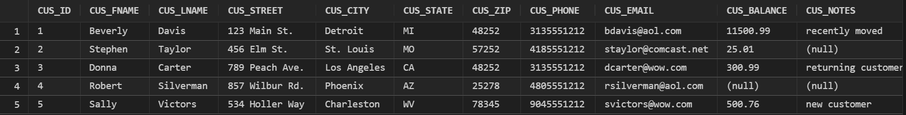
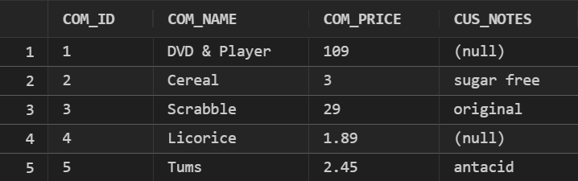
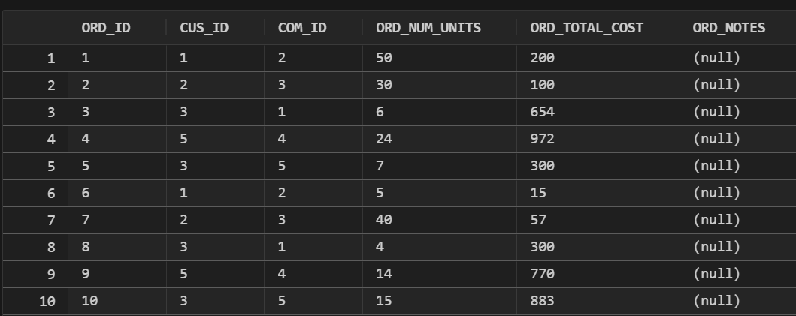
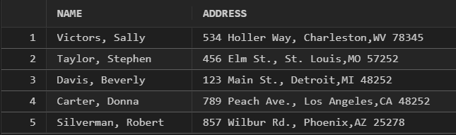

# LIS3781

## Mark Trombly

### Assignment 3 Requirements:

*Four Parts:*

1. Install Oracle server 
2. Instll Oracle extension for VSCode
3. Create sql statements to build customer and comodity tables
4. Populate customer and comodity table data from sql file

#### README.md file should include the following items:

* Screenshot of sql for table creation
* Screenshot of populated tables
* Screenshot of one report
* Sql solution [lis3781_a3_solutions.sql](lis3781_a3_solutions.sql "lis3781_a3_solutions.sql Link")

#### Assignment Screenshots:

*Screenshot of sql for table creation*:

*Screenshot of populated tables*:

*Customer Table*:

*Commodity Table*:

*Oder Table*:

*Screenshot of one report*:

#### Repository Links:

*Bitbucket Repository*
[Bitbucket Repository Link](https://bitbucket.org/marktrombly/lis3781/src/master/ "Bitbucket Repository Link")