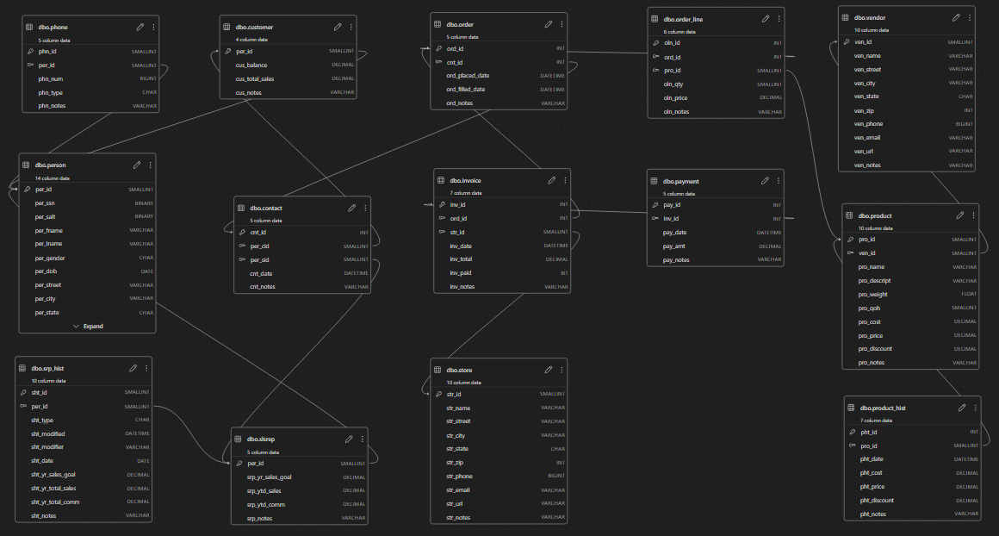
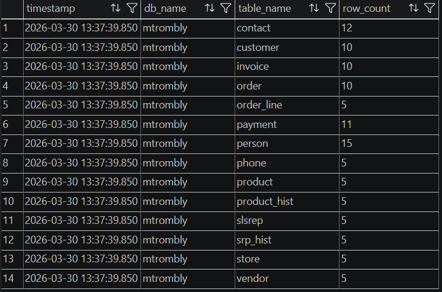
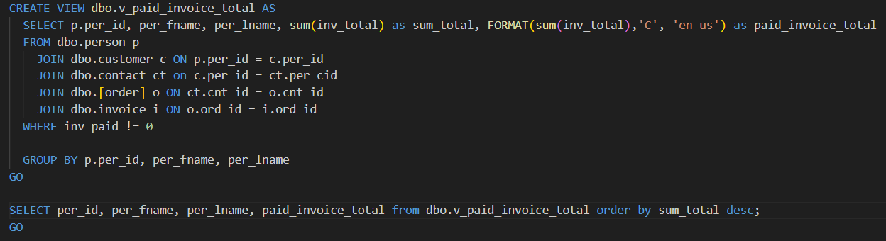
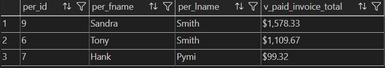

# LIS3781

## Mark Trombly

### Assignment 4 Requirements:

*Five Parts:*

1. Install SQL express
2. Install SQL extension for VSCode
3. Create SQL statements to build 14 tables
4. Populate 14 table data from sql file
5. Screenshot report

#### README.md file should include the following items:

* Screenshot of ERD;
* Screenshot: of Report, and SQL code solution.
* Sql solution [lis3781_a4_solutions.sql](lis3781_a4_solutions.sql "lis3781_a4_solutions.sql Link")

#### Assignment Screenshots:

*Screenshot of ERD*:

*Screenshot of tables and data*:

*Screenshot of report sql*:

*Screenshot of report*:

#### Repository Links:

*Bitbucket Repository*
[Bitbucket Repository Link](https://bitbucket.org/marktrombly/lis3781/src/master/ "Bitbucket Repository Link")