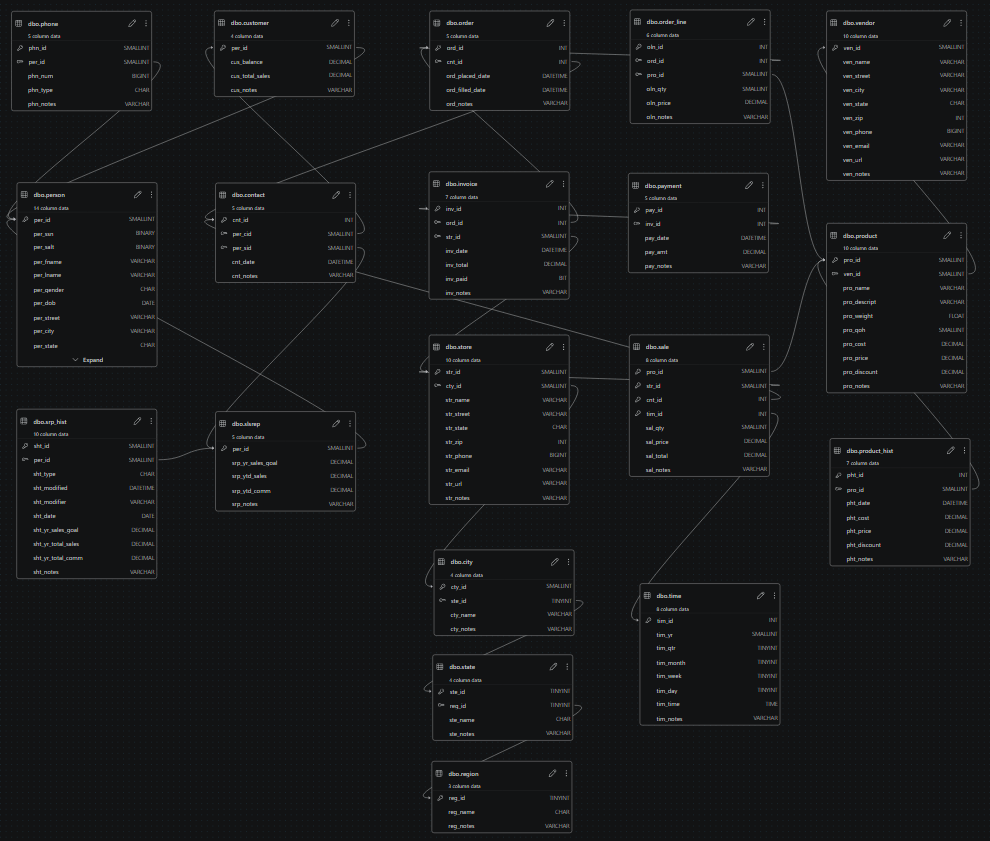
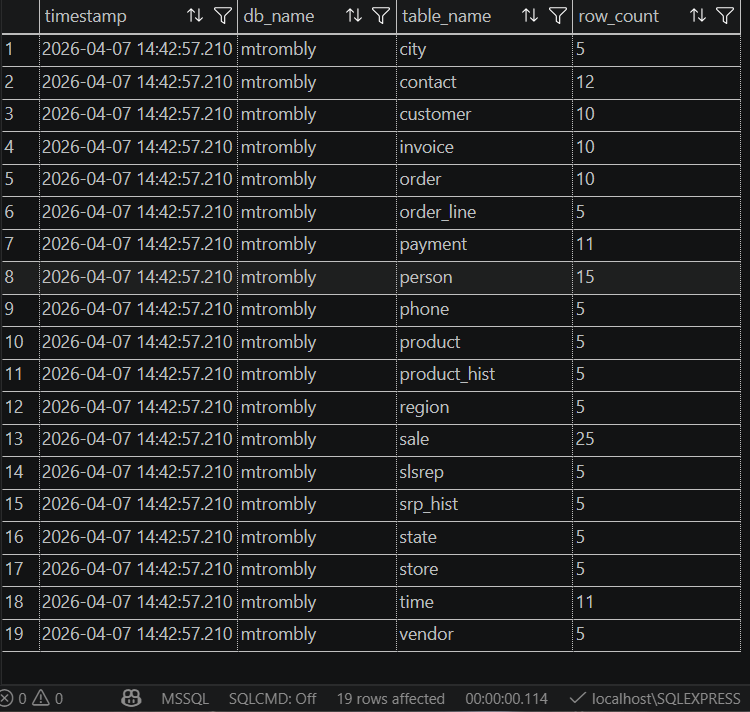
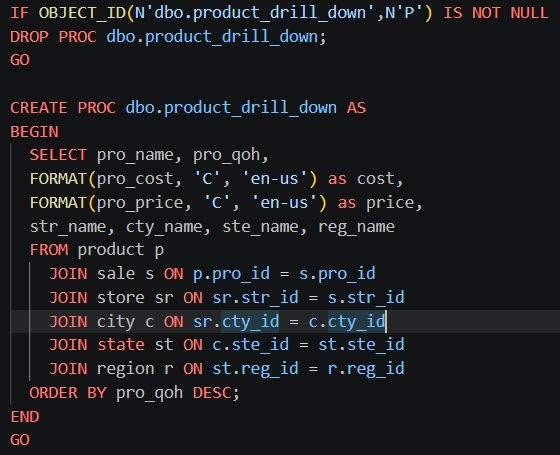
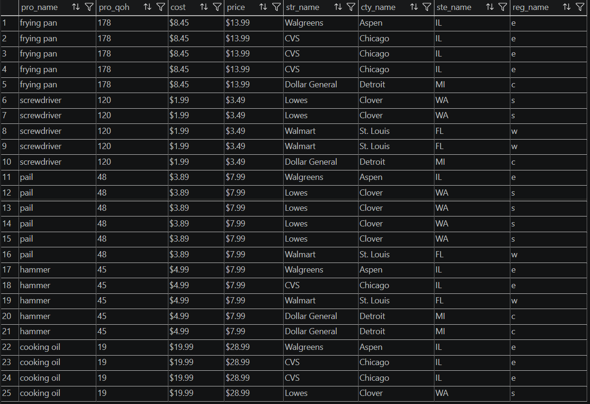

# LIS3781

## Mark Trombly

### Assignment 5 Requirements:

*Four Parts:*

1. Expand A4 database to extend the capabilities of data warehousing analytics and business intelligence (BI)
2. Create SQL statements to build all tables
3. Populate table data from sql file
4. Screenshot report

#### README.md file should include the following items:

* Screenshot of ERD.
* Screenshot of tables and data.
* Screenshot: of Report, and SQL code solution.
* Sql solution [lis3781_a5_solutions.sql](lis3781_a5_solutions.sql "lis3781_a5_solutions.sql Link").

#### Assignment Screenshots:

*Screenshot of ERD*:

*Screenshot of tables and data*:

*Screenshot of report sql*:

*Screenshot of report*:

#### Repository Links:

*Bitbucket Repository*
[Bitbucket Repository Link](https://bitbucket.org/marktrombly/lis3781/src/master/ "Bitbucket Repository Link")