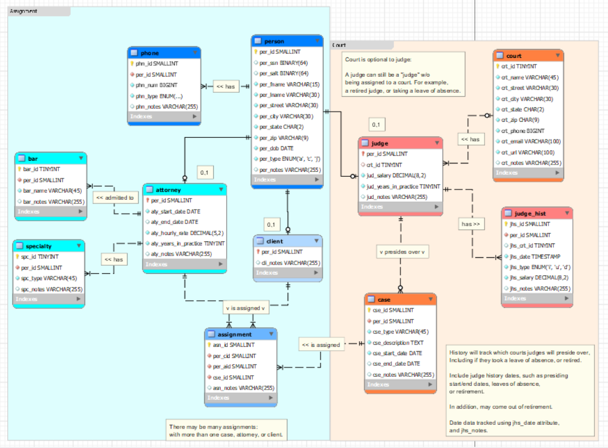
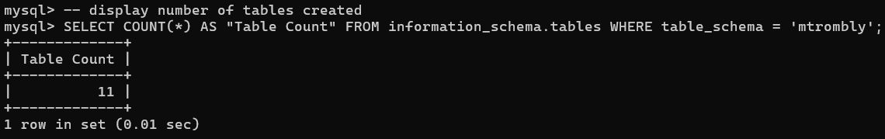
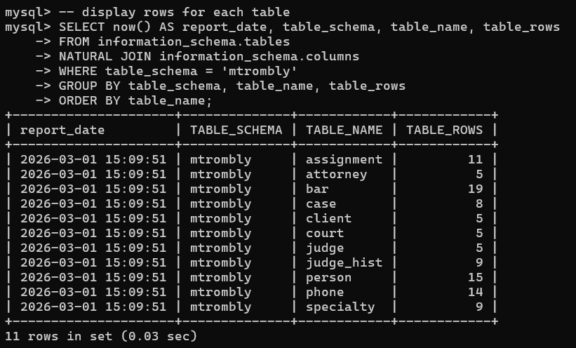
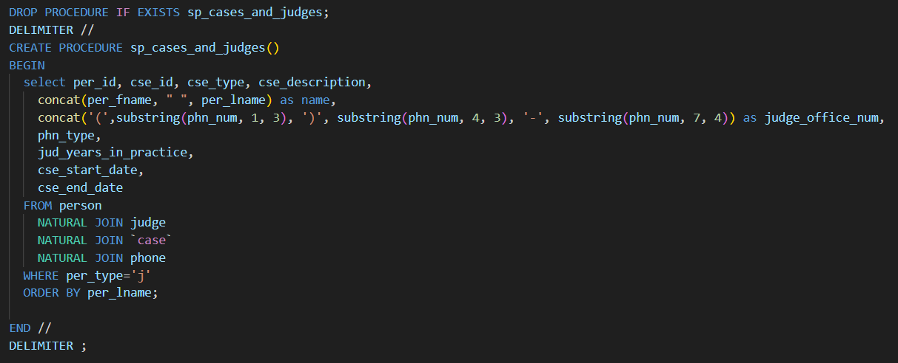
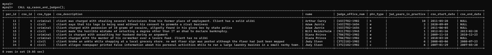

# LIS3781

## Mark Trombly

### Project 1 Requirements:

*Five Parts:*

1. Create ERD.
2. Forward engineer ERD to database.
3. Create query to display table count.
4. Create query to display populated tables.
5. Create report query.

#### README.md file should include the following items:

* Screenshot of ERD;
* Screenshot of number of tables (11);
* Screenshot of populated tables (11);
* Screenshot: of Report, and SQL code solution.
* Sql solution [lis3781_p1_solutions.sql](lis3781_p1_solutions.sql "lis3781_p1_solutions.sql Link")

#### Assignment Screenshots:

*Screenshot of ERD*:

*Screenshot of number of tables*:

*Screenshot of populated tables*:

*Screenshot of report sql*:

*Screenshot of report*:

#### Repository Links:

*Bitbucket Repository*
[Bitbucket Repository Link](https://bitbucket.org/marktrombly/lis3781/src/master/ "Bitbucket Repository Link")