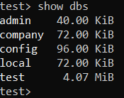
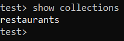
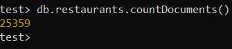
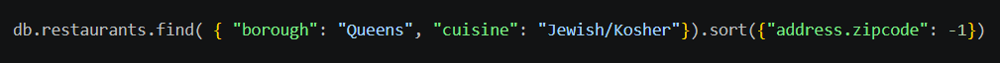
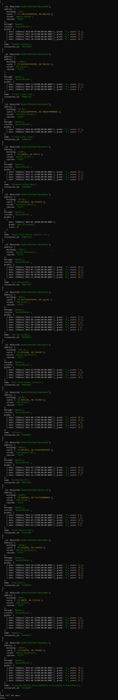

# LIS3781

## Mark Trombly

### Project 2 Requirements:

*Five Parts:*

1. Install MongoDB
2. Install MongoSH
3. Import sample data into collection
4. Screenshot of Mongodb shell command
5. Screenshot of one report and JSON code

#### README.md file should include the following items:

* Screenshot of Mongodb shell command
* Screenshot of one report and JSON code
* JSON solution [lis3781_p2_solutions.js](lis3781_p2_solutions.js "lis3781_p2_solutions.js Link")

#### Assignment Screenshots:

*Screenshot of MongoDB shell command*:

*Screenshot of report JSON*:

*Screenshot of report*:

#### Repository Links:

*Bitbucket Repository*
[Bitbucket Repository Link](https://bitbucket.org/marktrombly/lis3781/src/master/ "Bitbucket Repository Link")